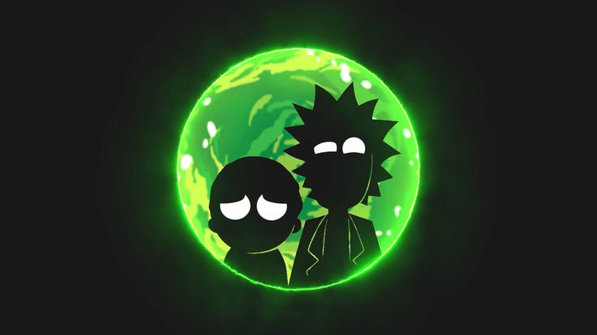
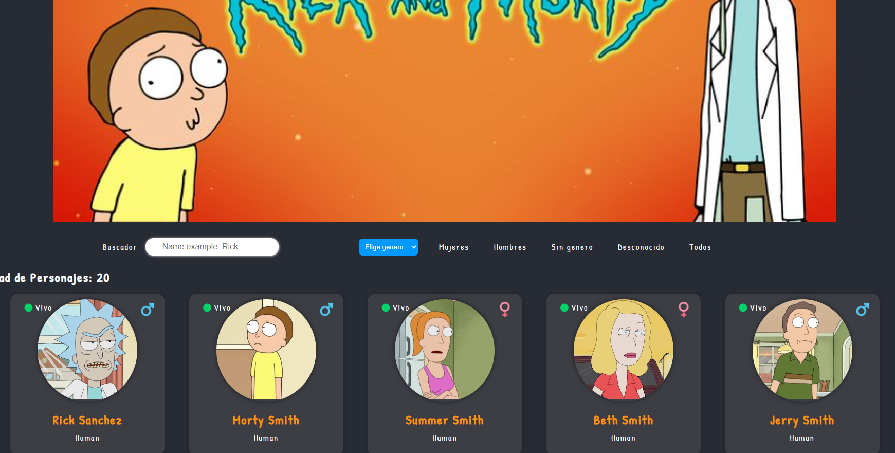
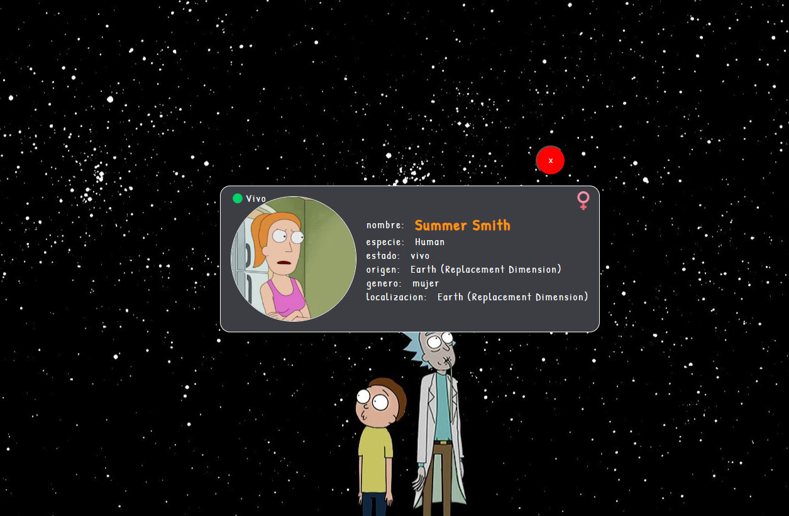

# Rick and Morty - Aplicación de Búsqueda de Personajes

Esta aplicación web permite buscar y explorar personajes de la serie de televisión "Rick and Morty". Los usuarios pueden realizar búsquedas filtradas por nombre, especie, género y estado, y navegar por los resultados de la búsqueda. Además, la aplicación presenta una vista detallada de los personajes seleccionados.
## Deploy 
Link para ir al deploy [ir ala pagina](https://lovely-taffy-f5a3d9.netlify.app/)

## Características

- Búsqueda avanzada de personajes con filtros por nombre, especie, género y estado.
- Navegación por los resultados de búsqueda paginados.
- Visualización detallada de los personajes seleccionados.
- Diseño atractivo con un carrusel de imágenes de fondo.

## Capturas de Pantalla

## Tecnologías Utilizadas

- HTML
- CSS (Bootstrap)
- JavaScript

## Cómo Utilizar

1. Abre `index.html` en tu navegador web.
2. Utiliza los filtros de búsqueda para refinar los resultados.
3. Navega a través de los resultados usando los botones de paginación.
4. Haz clic en un personaje para ver más detalles.

## Créditos

- La aplicación utiliza la API de "Rick and Morty" para obtener información de los personajes.

## Autor

Este proyecto fue creado por Daniel Villalba.

## Licencia

Este proyecto está bajo la Licencia MIT. Consulta el archivo [LICENSE](./LICENSE) para obtener más detalles.

---

Derechos de autor © 2024. Todos los derechos reservados.
